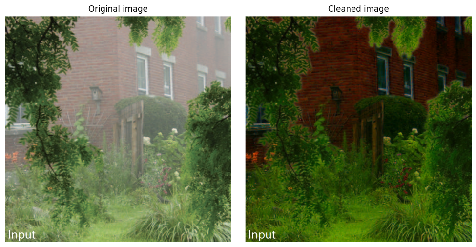
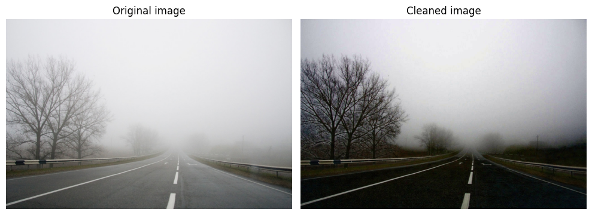
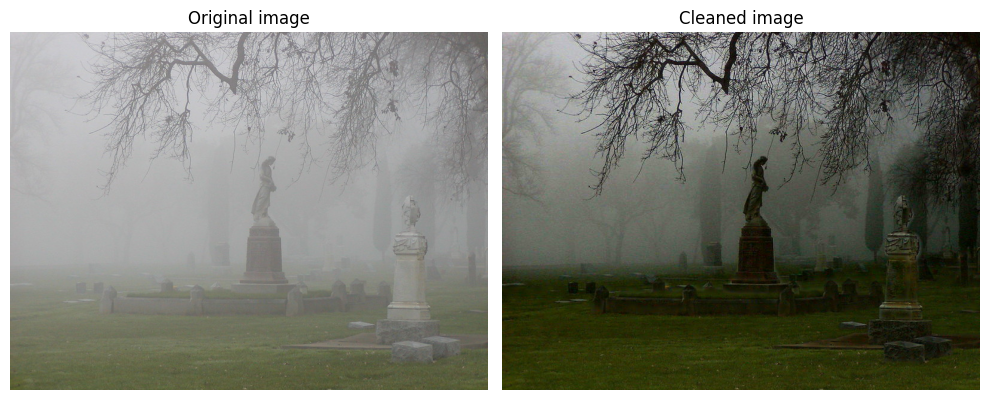

# DCP Dehaze

A python module dedicated to dehaze images using channel-wise model and Dark Channel Prior (DCP).

[](https://www.python.org/)
[](https://python-poetry.org/)

## 🛠 Installation

### Requirements
- Python 3.8+
- Poetry 1.5+

### Poetry (Recommended)
```bash
# 1. Install poetry
pip install poetry

# 2. Clone this repo
git clone https://github.com/KIrillPal/DCP-Dehaze.git
cd DCP-Dehaze

# 3. Install dependencies
poetry install

# 4. Activate the environment
poetry shell
```

### Usage
This module provides 2 main function: `haze` and `dehaze`.
Also it contains an implementation of `DCP` class which computes DCP for an a image with a specific kernel.

```Python
from dcp_dehaze import haze, dehaze, DCP
```

You can check the usage of the module in this notebook: [notes/task.ipynb](notes/task.ipynb)

### Examples

An example of syntetic fog generated by `haze` using depth map of an image.
Also an example of dehazing algorithm by `dehaze`.


Examples with a real fog:



